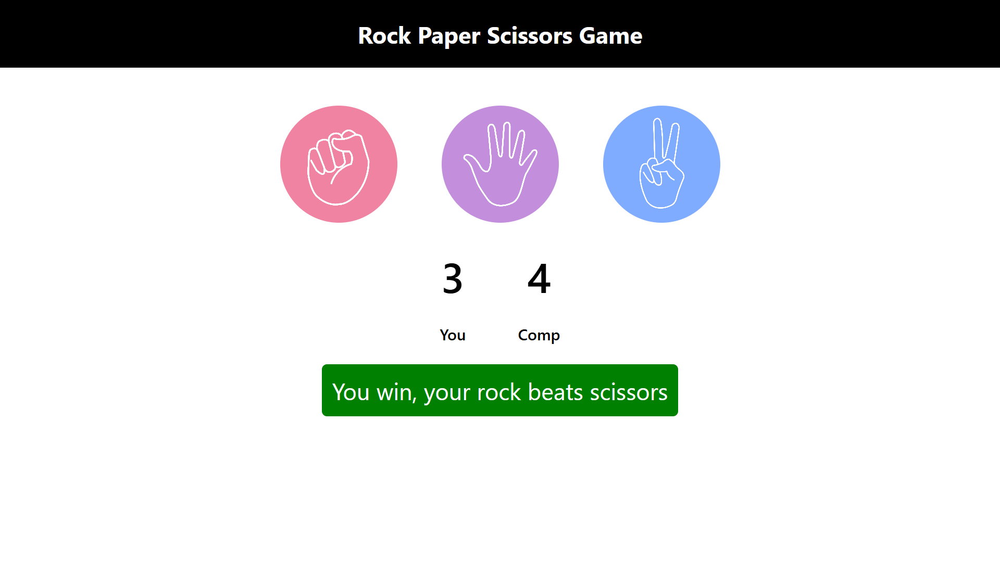

🚀 Rock Paper Scissors Game
A simple and interactive Rock Paper Scissors game built using HTML, Tailwind CSS, and JavaScript. This project demonstrates core web development concepts and interactive elements in a fun and engaging way.

🛠 Technologies Used:
HTML: Markup structure for the game.

Tailwind CSS: Utility-first CSS framework for responsive and modern styling.

JavaScript: Core game logic, event handling, and DOM manipulation.

📚 Concepts Explored:
Array: Managing and selecting game choices.

Functions: Creating reusable game logic.

Higher Order Functions: Functions passed as arguments to other functions.

Callback Functions: Executing logic after certain actions.

DOM Manipulation: Dynamically updating the user interface based on game states.

Event Handling: Reacting to user interactions such as clicks.

Event Listeners: Attaching event listeners to DOM elements (e.g., for game choices).

Event Object: Capturing detailed event information to control game flow.

forEach: Iterating through elements such as player choices.

📈 Key Takeaways:
Hands-on practice with JavaScript functions, DOM manipulation, and event handling.

Creating an interactive web-based game from scratch.

Styling and responsiveness using Tailwind CSS.

Feel free to check out the source code and try the game live! 🎮
